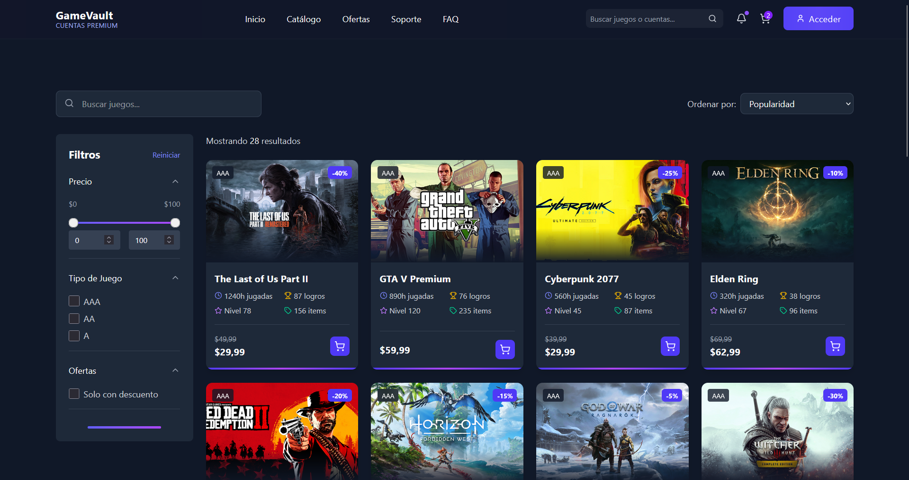
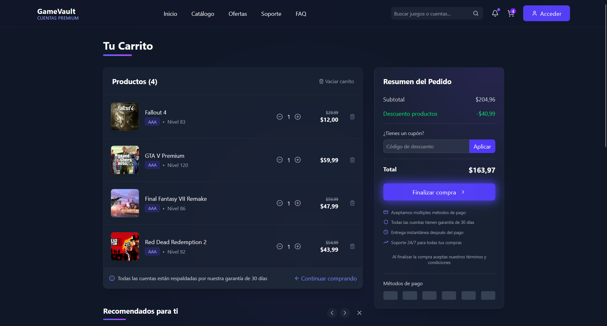
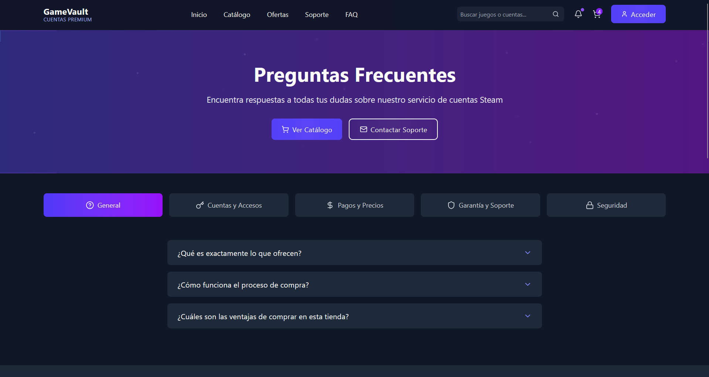

# Koari

## Descripción

Koari es una plataforma moderna desarrollada con React + Vite que ofrece a los usuarios la posibilidad de adquirir acceso a cuentas de Steam verificadas a precios competitivos. Nuestro sitio proporciona una experiencia de compra fluida, segura y con entrega inmediata de credenciales tras la compra.

## ✨ Características Principales

- 🛒 Amplio catálogo de cuentas de Steam verificadas
- 🔒 Proceso de compra 100% seguro y confiable
- ⚡ Entrega inmediata después de la compra
- 💰 Precios imbatibles en el mercado
- 🛡️ Garantía de reemplazo
- 🌟 Soporte técnico dedicado 24/7

## 🛠️ Tecnologías Utilizadas

- **React** - Biblioteca de JavaScript para construir interfaces de usuario
- **Vite** - Herramienta de compilación que proporciona una experiencia de desarrollo más rápida
- **Framer Motion** - Biblioteca para crear animaciones fluidas
- **Lucide React** - Iconos personalizables para React
- **Tailwind CSS** - Framework CSS para diseño responsive

## 🚀 Instalación y Configuración

### Requisitos Previos

- Node.js (v14.0.0 o superior)
- npm o yarn

### Pasos de Instalación

```bash
# Clonar el repositorio
git clone https://github.com/AmiiGood/burguir-front.git

# Cambiar al directorio del proyecto
cd burguir-front

# Instalar dependencias
npm install
# o
yarn install

# Iniciar el servidor de desarrollo
npm run dev
# o
yarn dev
```

La aplicación estará disponible en `http://localhost:5173/`

## 📁 Estructura del Proyecto

```
steamkey-store/
├── public/
├── src/
│   ├── assets/
│   ├── components/
│   │   ├── catalogo/
│   │   │   ├── CatalogoFilters.jsx
│   │   │   └── CatalogoPaginator.jsx
│   │   ├── layout/
│   │   │   ├── AnimatedCounter.jsx
│   │   │   ├── FeatureCard.jsx
│   │   │   ├── FeaturedCarousel.jsx
│   │   │   ├── Footer.jsx
│   │   │   ├── Header.jsx
│   │   │   ├── NeonButton.jsx
│   │   │   ├── NeonLine.jsx
│   │   │   ├── Particles.jsx
│   │   │   ├── PreFooter.jsx
│   │   │   └── Testimonial.jsx
│   │   └── product/
│   │       ├── ProductGrid.jsx
│   │       └── ProductCard.jsx
│   ├── data/
│   │   └── products.js
│   ├── pages/
│   │   ├── HomePage.jsx
│   │   ├── 404.jsx
│   │   ├── CatalogoPage.jsx
│   │   └── FAQPage.jsx
│   ├── App.jsx
│   ├── App.css
│   ├── index.css
│   └── main.jsx
├── .gitignore
├── eslint.config.js
├── index.html
├── package.json
├── README.md
└── vite.config.js
```

## 📱 Capturas de Pantalla






## 📈 Estadísticas

- 5,000+ Clientes satisfechos
- 12,000+ Cuentas vendidas
- 98% Valoración positiva
- Soporte disponible 24/7

## 🤝 Contribución

Las contribuciones son bienvenidas. Para contribuir:

1. Haz un Fork del proyecto
2. Crea una nueva rama (`git checkout -b feature/nueva-caracteristica`)
3. Realiza tus cambios y haz commit (`git commit -m 'Añadir nueva característica'`)
4. Sube tus cambios (`git push origin feature/nueva-caracteristica`)
5. Abre un Pull Request

## 📝 Licencia

Este proyecto está licenciado bajo la Licencia MIT - ver el archivo [LICENSE](LICENSE) para más detalles.

## 📞 Contacto

Si tienes preguntas o necesitas ayuda, no dudes en contactarnos:

- 📧 Email: soporte@koari.com
- 📱 Soporte: Disponible 24/7 a través de redes sociales

---

⭐ **¡Gracias por elegir Koari!** ⭐
